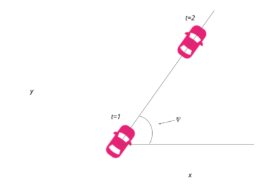
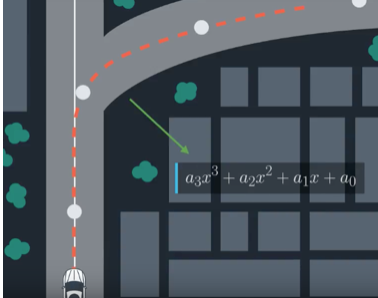
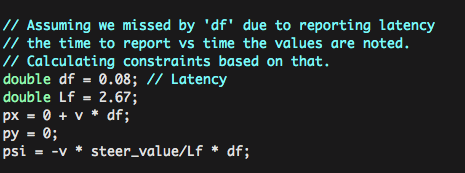
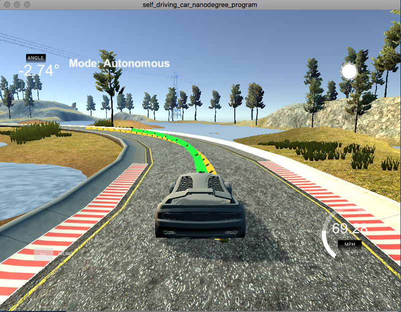

## Implementation of Model Predictive Control (MPC) For autonomous vehicle.

## Table of Contents ##

- [Goal](#goal)
- [How to run](#howto)
- [Implementation - MPC](#Implementation)
- [Effects of cost](#cost)
- [Final Result](#final)
- [References](#references)
- [Future Enhancements](#enhancements)

## Goal: 
Implementation of MPC controller to control maneuver of the vehicle. This Project utilizes
the simulator where the car utilizes the MPC object to control the steering angle and throttle.
Also, Uses 3rd order polynomial to predict the path and find CTE (cross track error) from the
prediction.

## How to run: 

	Steps:

	- Download the project zip file and extract it.
	- Enter into src directory: **cd extracted_folder/src; **
	- optional - Make build directory: **mkdir build && cd build**
	- Compile the code: **cmake .. && make** // Note: For build issues try removing CmakeCacheFile.txt
	- Run the code: **./mpc ** - Notice connected to port 4567.
	- Start the simulator and select PID Controller.
	- The similator once conected should start utilizing the MPC controller.

## Implementation - MPC: 

   Model: MPC- Model Predictive Control uses Kinematic model to determine the state of the 
          vehicle at time t. Given the state is known at time t-1. These predictions will
          be applied to estimate how far the vehicle is from estimate calculated using a third
          order polynomial. The model should technically take other factors - Dynamic controllers
          like tire pressure, rotation, friction etc., Here the model only uses time difference in 
          reporting to actual noting time of state at t-1 - 100 milliseconds.
          Following formulas are used:
          
          given
          

   Prediction: Uses a 3rd order polynomial to determine/predict the trajectory path using polyeval
               and polyfit functions.
         

   Timestep length and Elapsed Duration ( N  & dt): For every initial state it tries to predict N
         steps next with a delta_t of dt. So each constraint and accutators (steering_angle_difference,
         throttle) are calculated at delta t. By doing so it estimates the cost function so its actuators
         result in better judging the manuver of the vehicle.
         In this project I started with N = 10 and dt = 0.12 - This resulted in long green line and too much
         differential component (difference between 2 time stamps was large.)
         ii) tried with N = 10, df=0.1; Which still had issues when manuvering a real 3rd oder polynomial 
         graph. The prediction was off from estimate.
         iii) Reduced N to 8 and able to see clearly that differntial factor after hitting high CTE's.
         iv) Reduced dt to 0.08 and N 8 and this seems to stablize the prediction for higher speeds to 75. 
         Note: for each change of these values, Multiple cost factors for actuators and sequential difference factors
         were modified.
   Polynomial fitting and MPC preprocessing:
         Since ptsx and ptsy values are given wrt to MAP coodrinate system these need to be converted to Vehicle
         co-ordinate sytem so predictions are done in that coordinate system. But impact of latency was seen a lot.
         The yellow and Green lines were quite off. To stabilize I tried (Ref: internet and blogs of previous students)
         to make it in reference with X and Y values so the predictions are done with x=0, y=0 and steerign angle =0.
         So difference between ptsx.x[i]-x was effective. Please see image below:
         

   Cost factors: A detailed explanation is given in code on how these factors were choosed. In short the cost
         actuators impacted a lot on steering angle movement and acceleration. Also, I tried to do Squared distance
         of sequential readings of actuators and CTE and orientation errors.
         The factors for actuators and sequential difference of actuators at 100 seems more stable.
         Final Cost of Steering angle is taken at 200.
         Final cost of acceleration is taken ad 0.5.
         Cost of sequential difference in acceleration pow((at - at-1), 2) and angle were multipled with factor of 100
         giving more value to difference noted between 2 predictions.

   Latency: As noted in Tips, the time to record and actually report is 100 Millisecond. I applied same df as 0.08
         and kinematic functions at t-2 given the inital values are calculated at t-1. This worked pretty well. 
         Relative calculation of waypoints and thus coefficients helped much here with simple calculations as
         px, py are 0.
         

## Final result: 
	This video shows the final result of the project with MPC controller.
	

## References: 
	1. Udacity MPC controller practice sample.
	2. https://www.coin-or.org/CppAD/Doc/ipopt_solve.htm
   3. https://en.wikipedia.org/wiki/Cubic_function
   4. https://eigen.tuxfamily.org/dox/group__matrixtypedefs.html#ga8554c6170729f01c7572574837ecf618
   5. Automative Model Predictive control by Luigi Del re, FrankAllgower. (Calculating effective cost)
   6. https://stanford.edu/class/ee364b/lectures/mpc_slides.pdf
   7.https://web.stanford.edu/class/archive/ee/ee392m/ee392m.1056/Lecture14_MPC.pdf

## Future Enhancements: 
 1. Calculate df as a factor of other constraints?
