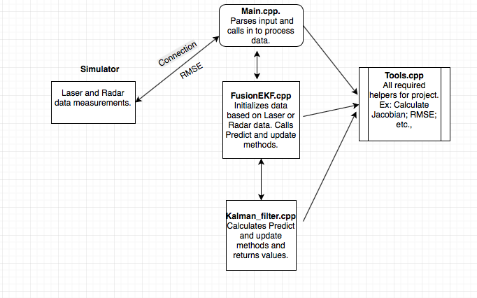
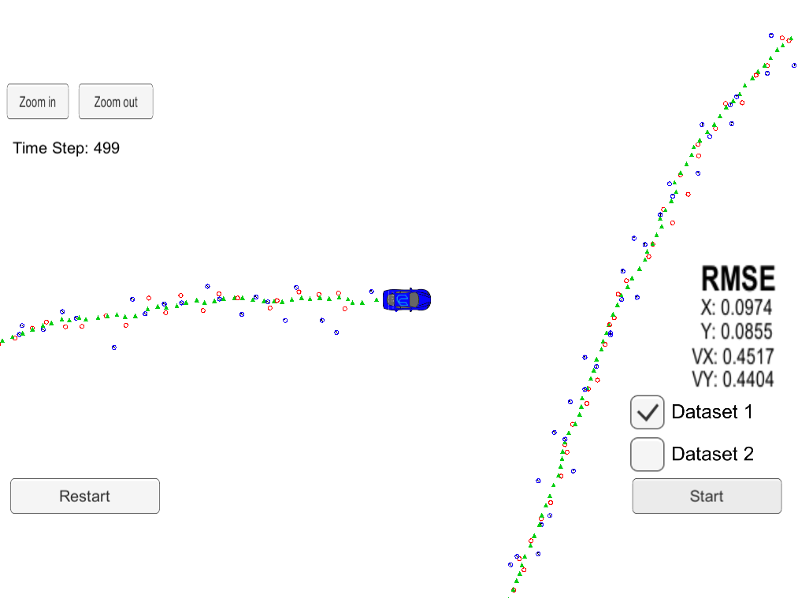
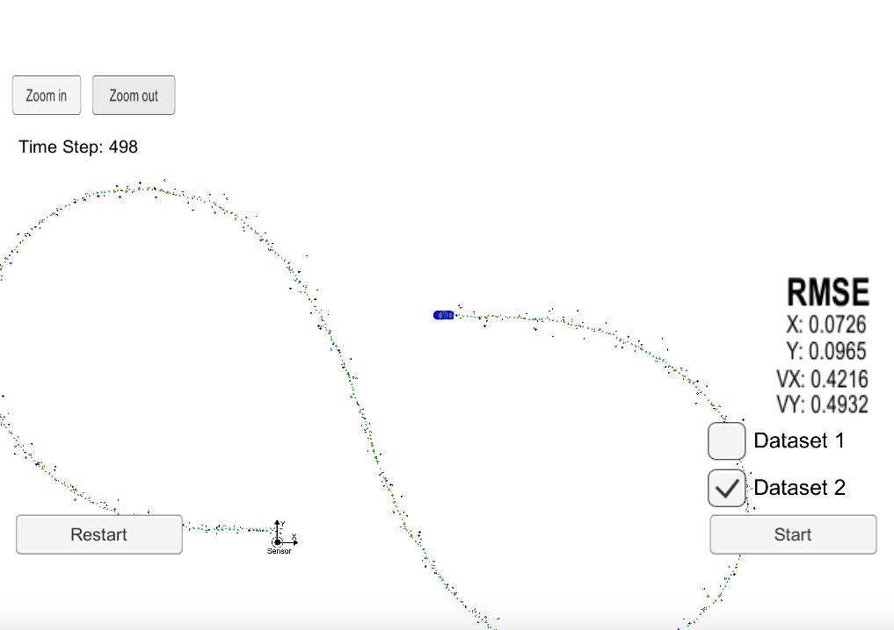
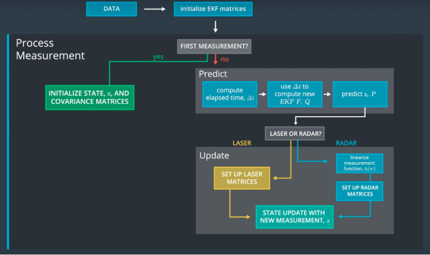
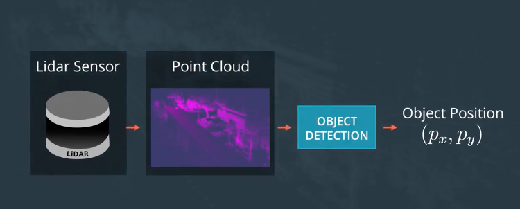
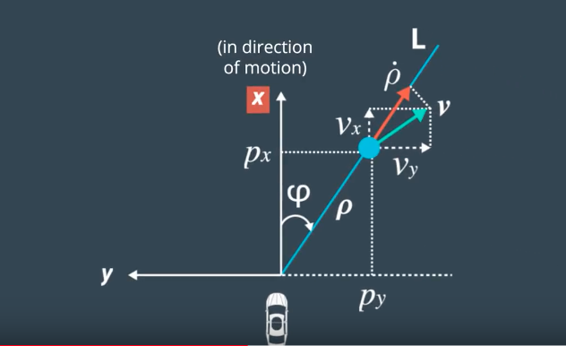
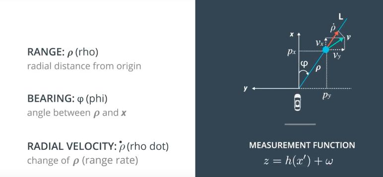
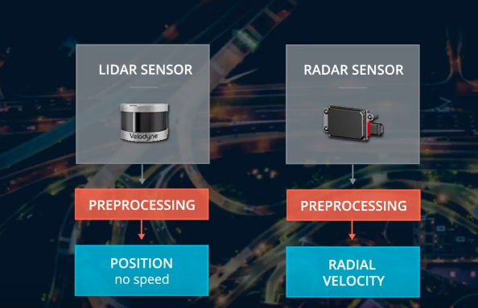
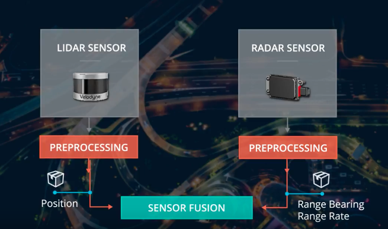

## Object Tracking with Sensor Fusion - Extended Kalman Filter.

## Table of Contents ##

- [Goal](#goal)
- [How to run](#howto)
- [Code Flow](#codeflow)
- [Results](#results)
- [Measurement Process](#measurement)
- [Lidar measurement](#lidar)
- [Radar measurement](#radar)
- [Sensor Fusion](#sensorfusion)
- [References](#references)
- [Future Enhancements](#enhancements)

## Goal: 

	Track objects - Pedistrian, other vehicles or other objects; using sensor data from LIDAR and RADAR measurements
	and apply extended kalman filter to track the objects.

## How to run: 

	Steps:

	- Dowload the project zip file and extract it.
	- Enter into src directory: **cd extracted_folder/src; **
	- optional - Make build directory: **mkdir build && cd build**
	- Compile the code: **cmake .. && make**
	- Run the code: **./ExtendedKF ** - Notice connected to port 4567.
	- Start the simulator and select Kalman filter; and select Dataset 1 or Dataset 2.
	- Notice RMSE values will be updated in sumulator.

## Code Flow: 

	Main.cpp:
	Runs the code flow by connecting to simulator and start to read input data from
	simulator. Main.cpp calls into FusionEFK.cpp to initialize, update and predict-update process of the
	code to track the object. 

	FusionEFK.cpp:
	Initialization and processing of measurement data is done in this file.
	which then calls to update method in Kalmanfilter.cpp.

	KalmanFilter.cpp:
	Update and Predition logic are implemented in
	kalmanFilter.cpp. 

	Tools.cpp:
	Helper methods to support prediction and update along with general helpers
	ex: calculating Jacobian, Calculate RMSE, CartesianToPolar etc.,
	

## Results: 

- Dataset 1
  	Values: 
	RMSE X: 0.0973178
	RMSE Y: 0.0854597
	RMSE VX: 0.451267
	RMSE VY: 0.439935
 

- Dataset 2
	Values:
	RMSE X: 0.0726                                                                                                                                     
	RMSE Y: 0.0965
	RMSE VX: 0.4216
	RMSE VY: 0.4932
 

## Measurement Process: 

   ** first measurement**: the filter will receive initial measurements of an object's position relative to the car. These measurements will come from a radar or lidar sensor.
   ** initialize state and covariance matrices**: the filter will initialize the object's position based on the first measurement then the car will receive another sensor measurement after a time period Δt.
   **predict**: the algorithm will predict where the bicycle will be after time Δt. One basic way to predict the bicycle location after Δt is to assume the object's velocity is constant; thus the object will have moved velocity * Δt. 
   **update**: the filter compares the "predicted" location with what the sensor measurement says. The predicted location and the measured location are combined to give an updated location. The Kalman filter will put more weight on either the predicted location or the measured location depending on the uncertainty of each value then the car will receive another sensor measurement after a time period Δt. The algorithm then does another predict and update step.

 

## Lidar measurement: 

	- z = transpose (px py) is the measurement vector. For a lidar sensor, the z vector contains the position−x and position−y measurements.

	- H is the matrix that projects your belief about the object current state into the measurement space of the sensor. 
	lidar sensor only measures position: The state vector x contains information about [p​x​​,p​y​​,v​x​​,v​y​​] whereas the z vector will only contain [px,py]. 
	Multiplying Hx allows us to compare x, our belief, with z, the sensor measurement.

 

## Radar measurement: 

	- The range, (ρ), is the distance to the pedestrian. The range is basically the magnitude of the position vector ρ which can be defined as ρ=sqrt(p​x​2​​+p​y​2​​).
	- φ=atan(p​y​​/p​x​​). Note that φ is referenced counter-clockwise from the x-axis, so φ from the video clip above in that situation would actually be negative.
	- The range rate, ​ρ​˙​​, is the projection of the velocity, v, onto the line, L.

 

## Sensor Fusion: 
	- Sensor fusion is way to mix Lidar and radar data to correctly predict the object.

## References: 
	1. https://en.wikipedia.org/wiki/Jacobian_matrix_and_determinant
	2. http://katbailey.github.io/post/gaussian-processes-for-dummies/
	3. https://www.ncbi.nlm.nih.gov/pmc/articles/PMC5351863/
	4. https://github.com/GeoffBreemer/SDC-Term2-P1-Extended-Kalman-Filters/blob/master/README.md
	5. C++ ref.
	
## Future Enhancements: 
 1. Modify main.cpp to easily switch between 2 data sets without restarting.
 2. Provide more code metrics - Calcuations for when RMSE is exceeding and improve/reset.
 3. Code style is switch between Udacity style and my VIM style. Making it hard to read for self. 
 4. Find alternatives to Jacobian and other improvements.
