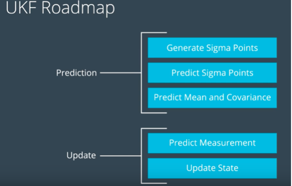

## Object Tracking with Unscented Sensor Fusion - Unscented Kalman filter (UKF).
Murali Madala

## Table of Contents ##

- [Goal](#goal)
- [How to run](#howto)
- [UKF](#ukf)
- [Results](#results)
- [NIS](#nis)
- [Future Enhancements](#enhancements)

## Goal: 

	Track objects - Pedistrian, other vehicles or other objects; using sensor data from LIDAR and RADAR measurements
	and apply Unscented kalman filter to track the objects. The main idea on using Unscented Kalman filters
	is the process of handling non-linear functions. The predictions are supposed to be accurate and measurable.

## How to run: 

	Steps:

	- Dowload the project zip file and extract it.
	- Enter into src directory: **cd extracted_folder/src; **
	- optional - Make build directory: **mkdir build && cd build**
	- Compile the code: **cmake .. && make**
	- Run the code: **./UnscentedKF ** - Notice connected to port 4567.
	- Start the simulator and select Kalman filter; and select Dataset 1 or Dataset 2.
	- Notice RMSE values will be updated in sumulator.

## UKF: 
	In Unscented Kalman filter, constant turn rate and velocity magnitude model (CTRV) is adpoted. The UKF takes
	representative points from Gaussian distribution (Sigma points) and plug them to non-linear equations to predict.

	CTRV model:
	

	UKF Roadmap:
	

## Results: 

	
	

## NIS: 
	Normalized innovation squared Measurements (NIS) for ladar and Radar are calculated at the end of update step
	and when looking at 95% confidence level here is how it looks with this solution.

	
	
## Future Enhancements: 
 1. Modify main.cpp to easily switch between 2 data sets without restarting.
 2. Provide more code metrics - Calcuations for when RMSE is exceeding and improve/reset.
 3. Nice to do Additional bonus project.
 4. Experiment with various weight calcuations and lambda values.
