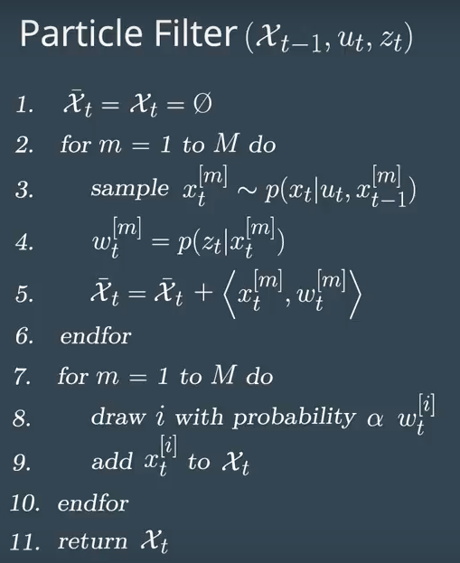

## Kidnapped Vehicle
Murali Madala

## Table of Contents ##

- [Goal](#goal)
- [How to run](#howto)
- [Code Flow](#codeflow)
- [Results](#results)
- [Notes](#notes)
- [Future Enhancements](#enhancements)
- [References](#references)

## Goal: 

    The goal of the project is to predict where you are from what you know - Predicting where the kidnapped vehicle is by using particle filter given the Map, and localization information - Analogous to GPS information.

## How to run: 

	Steps:
        - Dowload the project zip file and extract it.
        - Enter into src directory: **cd extracted_folder/src; **
        - optional - Make build directory: **mkdir build && cd build**
        - Compile the code: **cmake .. && make**
        - Run the code: **./Particle_filter ** - Notice connected to port 4567.
        - Start the simulator and select Kidnapped Vehicle.
        - Run the simulator until "success" message - Meaning the project 
		is being run successfully. Notice Error rate in X, Y and yaw.

## Code Flow: 

	The main.cpp file runs the code flow by connecting to simulator and start to read input data from
	simulator.
	Its Input is provided by the simulator :
	1. Sense noise position data. [sense_x], [Sense_y], [Sense_theta] 
	2. Get previous velocity and yaw rate - To predict particle transitiond state.
		[previous_velocity], [previous_yawrate]
	3. Recieve noisy observation from simulator - x/y values.
		[observations_x] [observations_y]
	4. Calls in particle-filter to get bayes filter posterior - More on this later.
	It output to simulator:
	1. best_particle_x, best_particle_y and best_particle_theta.

**Main and particle Filter interaction**:
	1. Senses noisy position data from simulator
	2. Calls particle filter to initialize or predict vehicles next state from previous data.
	3. Recieves noisy observation from simulator.
	4. Calls particle filter to estimate weights
	5. Make re-sample of particles.
	6. Steps 1-6 are repeated until it recieves message from simulator.

**Particle Filter**:
	Initialize or Predict:
	1. Initializes particles - Given values of x, y and theta. It initializes values at 
		random distance from x, y and various angle positions.
	2.  Predict particles bases on previous values : position, yaw_rate of particles.

	Update - Update weights - Total probablity of a particle wrt to vehicle position.
	 Given observations, landmarks - Updates weights of each particle using multi-variate
	 gaussian filter.
	 Does the following steps;
	 	1. Convert observations to MAP coordinates.
	 	2. Find closest particle to landmark.
	 	3. Make an association of predicted landmark to observations.
	 	4. Perform multi-variate gaussian calculation for observed landmark and predicted landmark
	 	5. Update weigths of particles based on step 4.
	
	Psudo code for particle filter:

## Results: 
	Result of particle filter solution after running through simulator:

 
 

## Notes: 
	- Observed the error in x, y with 100, 200 and 300 particles. With 100 particles the error rate was 0.12/0.11/0.06
		where as with 200 its close to 0.10/0.10/0.004 and with 300 its closer to 200 particles. For this given map
		I suspect 200 particles is right solution. Also execution time is directly related to num particles so taking
		account of that fact I decided 200 particles for this project is good enough.
	- For better performance, the disk buffers/cache needs to be flushed. I noticed this on re-running where originally took 
		the execution arround 95 seconds and post flush it is closer to 52 seconds. There could be multiple reasons behind
		this: Leaking objetcs, GC and more effective code. On real system I believe cache should be flushed deterministically. 
	
## Future Enhancements: 
 	1. Modify main.cpp to test with various sigma points i.e., Errors in Landmark Observation, GPS measurement errors
  		and sensor threshold. 
 	2. Provide more code metrics - Calcuations for when RMSE is exceeding and improve/reset.
 	3. In calculating weights in Particle_filter.cpp, Optimizations could be done like: 
 		- Calculating measurements/distance of landmark, particles to a common point when particles are initialized
 			and use those values to determine nearest particle during assoications.
 		- Creating multiple singleton members to re-use than re-calculate for ex: Converting to MAP coordinates from local
 			measurements.

## References : 
	1. http://en.cppreference.com/w/cpp/container/vector
	2. http://en.cppreference.com/w/cpp/numeric/random/discrete_distribution
	3. https://en.wikipedia.org/wiki/Multivariate_normal_distribution
	4. https://en.wikipedia.org/wiki/Particle_filter
	5. http://robots.stanford.edu/papers/thrun.pf-in-robotics-uai02.pdf
	6. https://people.eecs.berkeley.edu/~pabbeel/cs287-fa11/slides/particle-filters++_v2.pdf
