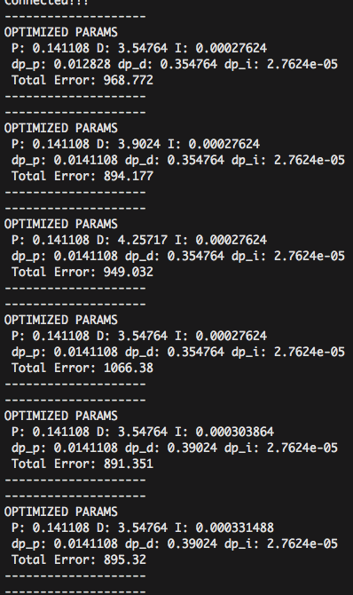

## Implementation of PID controller
    control maneuver of the vehicle.
    Murali Madala

## Table of Contents ##

- [Goal](#goal)
- [How to run](#howto)
- [Coefficient Calculation - PID](#coefficients)
- [Effects of each Coefficient](#effects)
- [Final Result](#final)
- [References](#references)
- [Future Enhancements](#enhancements)

## Goal: 
Implementation of PID controller to control maneuver of the vehicle. This Project utilizes
the simulator where the car utilizes the PID object to control the steering angle and throttle
based on error tracking mechanism.

## How to run: 

	Steps:

	- Download the project zip file and extract it.
	- Enter into src directory: **cd extracted_folder/src; **
	- optional - Make build directory: **mkdir build && cd build**
	- Compile the code: **cmake .. && make**
	- Run the code: **./pid ** - Notice connected to port 4567.
	- Start the simulator and select PID Controller.
	- The similator once conected should start utilizing the PID controller.

## Coefficients Calculation - PID: 

   In controlling the manuver of the vehicle PID control is nedded so the vehicle can adjust
   it self based on its tracking with-in/outside of lanes using error mechanism (CTE - Cross Track Error)
   provided by simulator.
   Having effective PID control means the coefficients - P, I, D play key role.
   P : Proportional to error; Proportional to Cross track error.
   I : Integral of error; Proportional to overall error's recorded during sampling.
   D : Differential error (Simplistic way: Difference between last noted error to previous)
   The control is effective on how well these 3 coefficients calculated correctly. 
   In this project these are calculated using manual and Twiddle algorithm to find the coefficients
   so the manuvering across the track is done correctly without going outside the track.

   Manual: Stated with 0, 0, 0 (PID) values and based on lessons thought in class, took random values
   starting with 0 and noticing how each coefficient is playing. Once a good portion of track is 
   covered, Calculating coefficients using Twiddle algorithm is used.
   Automatic Calculation using Twiddle: Here a total of N-samples are recorded for each correction
   by incrementing and decrementing a known factor (dp) and noticing how the CTE is trending and 
   if Overall CTE for sample steps is better than before it uses a multiple value of it until the overall
   CTE  weakens. At whcih point the dp factor is reduced by 0.9 and adjusts back. This continues for 3-4
   rounds with a sample of 1500 steps. This 1500 seems to be the overall steps covered in track. So a full
   track for each measurement is taken in consideration.

   For 3 coefficients I ran the simulator for approximatly 60 tracks at constant throttlle at .30. Once
   overall error hit ~120, those values are used.
   A snapshot of iterations..

## Effects of each coefficients: 

	The following short clips shows how each coefficient plays role:
	1) No Proportional control taken in consideration: (Kp =0) when calculating total error.
	Notice the vehicle is moving closer to lanes (right and left)

	2) No differential control taken in consideration. Notice the oscillations.

	3) No Intergral control taken into consideration.
				

## Final result: 
	This video shows the final result of the project with PID controller.

## References: 
	1. Udacity PID controller from Sabastian Thurn.
	2. https://ocw.mit.edu/courses/mechanical-engineering/2-154-maneuvering-and-control-of-surface-and-     underwater-vehicles-13-49-fall-2004/lecture-notes/lec16.pdf
	3. http://web.mit.edu/jorloff/www/18.03-esg/notes/extra/pid-jmo.pdf
	4. http://www.cs.stanford.edu/people/dstavens/thesis/David_Stavens_PhD_Dissertation.pdf

## Future Enhancements: 
 1.  Calculate steering coefficients using High throttle for ex: .70
 2.  Calculate steering coefficients and throttle coefficients.
