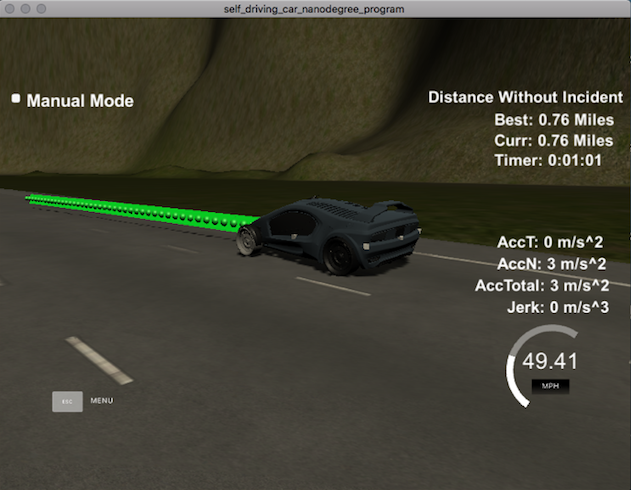

# CarND-Path-Planning-Project
Self-Driving Car Engineer Nanodegree Program
Murali Madala
   
### Goals

#### The goals for this project are:
1. Safely navigate around a virtual highway with other traffic that is driving +/-10 MPH of the 50 MPH speed limit. The car's localization and sensor fusion data is provided, and there is also a sparse map list of waypoints around the highway. 
2. The car should try to go as close as possible to the 50 MPH speed limit, which means passing slower traffic when possible, noting that other cars will try to change lanes too. 
3. The car should avoid hitting other cars at all costs, as well as drive inside of the marked road lanes at all times unless when the car is changing lanes. 
4. The car should be able to make one complete loop around the 6946 meters highway. Since the car is trying to go 50 MPH, it should take a little over 5 minutes to complete 1 loop. 
5. The car should not experience total acceleration over 10 m/s^2 and jerk that is greater than 10 m/s^3, in order to ensure a smooth ride.

### Code Model for generating paths

#### Ensure the car stays in its lane with constant velocity and moves forward smoothly: 
I used 5 anchor points, First 2 are either taken from car's position and prev_car position using theta, Remaining 
three points are evenly placed 30, 60 & 90 points ahead of car's position or previous path end points. In main.cpp, 
the lines are from 198 - 227.
Originally started with 3 points all of which from car's end points but it was quite ineffective and lead to
jerks and correcting. This combined with moving cars was reason for collusion. Adding 3 forward reference points 
helped in solving loosing track.

To give car's waypoints, these reference points are used to generate waypoints using Spline. To ensure car stays in
middle of lane, the reference points are taken from center of car's current lane using S-D plane. Using spline,
the waypoints are evenly placed. 

Given the changing distance between front car (between 30 meters to end-of-path), the distance between waypoints
are evenly placed out. The distance between waypoints shortens if the car is close to obstacle (other-car in this case.)\
and widens if there is no car in front 30 meteres from current car. Code for next 50 waypoints is in main.cpp (274-301)
 

Image below when the distance between front car and car is less than 30 meters. or Reduced speed.


#### Change lanes when it is safe to do so:
This is accomplished using the following pseudo code. 

For every_car detected by sensor_Fusion {
  if no_car_ahead_for_next_30_meters_in_same_lane
      continue;
  else {
      if (car_is_ahead_than_car)
          bool blocking_front = true;
      else if (not (no_cars_behind_in_left_lane_within_safe_merging_distance) or
               (no_cars_ahead_in_left_lane_within_safe_merging_distance)) {
               bool blocking_left = True;
             }
      // Preference given to merge left first.
      else if (not (no_cars_behind_in_right_lane_within_safe_merging_distance) or
                ( no_cars_ahead_in_right_lane_within_safe_merging_distance)) {
                bool blocking_right = True;
              }
}
Following code is in main.cpp; Function: processSensorFusion (line: 50)

Once the state of other cars is determined, Using the three booleans, Current car next state is determined
using the following logic:

    if (blocking_front) {
        if (car_in_left_most_lane and (not blocking_right)) {
            Change_lane_to_right;
        }
        else if(car_in_middle_lane) {
              if (not blocking_left) 
                  change_lane_to_left;
              else if (not blocking_right)
                  change_lane_to_right;
        }
        else if (car_in_right_lane and (not blocking_left)) {
            change_lane_to_left;
        }
        if (current_lane != new_lane) {
            Increase_velocity;
            current_lane = new_lane;
        }
        else // We have to slow-down and follow ahead car.
            reduce_velocity;
    }
    else {  // No blocking car ahead.
        if (not max_velocity)
            Increase_velocity;
        else
            continue;
    }

This code is in main.cpp; updateCarState line 108.

#### Ensure that there is no jerky motion and that speed limit is not violated: 
The car starts with zero velocity and increases slowly by increments of .447 m/s (1 MPH). Since main loop
is continuous loop with delay of .02 seconds or 50HZ. However, for reducing speeds - When following front car,
it reduces slowly at .224 m/s to maitian the distance. I wish I wrote a cost function to reduce the speed
wrt to distance to front car and amount of distance covered in a loop. But this worked in current situation.

Its done in main.cpp, UpdateCarState method line 135-145.

#### The end result video that passes all the project rubric criteria can be viewed here.
[](https://youtu.be/UCLE9B3QRHU) [here]
The vehicle drove for 15 mins without incident covering 10.35 miles.

### Further Improvements:
1) Write cost functions for accelerating and decelerating.
2) Cost function for finding cars in left/right lanes ahead and choosing which option is better
when changing lanes than giving priority to left. (This is low priority item.)
3) Use advance methods or techniques in spline to further smooth out the waypoints.
    Original implementation had way more jerks and collusion, Udacity walkthrough helped a lot or 
    I would be spending more weeks fine-tuning with frenet and calcuating distances. Lot of improvement
    is seen with spline and I wish I spent more time doing exprementing there.
---

### Simulator.
You can download the Term3 Simulator which contains the Path Planning Project from the [releases](https://github.com/udacity/self-driving-car-sim/releases).

#### The map of the highway is in data/highway_map.txt
Each waypoint in the list contains  [x,y,s,dx,dy] values. x and y are the waypoint's map coordinate position, the s value is the distance along the road to get to that waypoint in meters, the dx and dy values define the unit normal vector pointing outward of the highway loop.


The highway's waypoints loop around so the frenet s value, distance along the road, goes from 0 to 6945.554.

## Basic Build Instructions

1. Clone this repo.
2. Make a build directory: `mkdir build && cd build`
3. Compile: `cmake .. && make`
4. Run it: `./path_planning`.

Here is the data provided from the Simulator to the C++ Program

#### Main car's localization Data (No Noise)

["x"] The car's x position in map coordinates

["y"] The car's y position in map coordinates

["s"] The car's s position in frenet coordinates

["d"] The car's d position in frenet coordinates

["yaw"] The car's yaw angle in the map

["speed"] The car's speed in MPH

#### Previous path data given to the Planner

//Note: Return the previous list but with processed points removed, can be a nice tool to show how far along
the path has processed since last time. 

["previous_path_x"] The previous list of x points previously given to the simulator

["previous_path_y"] The previous list of y points previously given to the simulator

#### Previous path's end s and d values 

["end_path_s"] The previous list's last point's frenet s value

["end_path_d"] The previous list's last point's frenet d value

#### Sensor Fusion Data, a list of all other car's attributes on the same side of the road. (No Noise)

["sensor_fusion"] A 2d vector of cars and then that car's [car's unique ID, car's x position in map coordinates, car's y position in map coordinates, car's x velocity in m/s, car's y velocity in m/s, car's s position in frenet coordinates, car's d position in frenet coordinates. 

## Details

1. The car uses a perfect controller and will visit every (x,y) point it recieves in the list every .02 seconds. The units for the (x,y) points are in meters and the spacing of the points determines the speed of the car. The vector going from one point to the next in the list dictates the angle of the car. Acceleration both in the tangential and normal directions is measured along with the jerk, the rate of change of total Acceleration. The (x,y) point paths that the planner recieves should not have a total acceleration that goes over 10 m/s^2, also the jerk should not go over 50 m/s^3. 

2. There will be some latency between the simulator running and the path planner returning a path, with optimized code usually its not very long maybe just 1-3 time steps. During this delay the simulator will continue using points that it was last given, because of this its a good idea to store the last points you have used so you can have a smooth transition. previous_path_x, and previous_path_y can be helpful for this transition since they show the last points given to the simulator controller with the processed points already removed. You would either return a path that extends this previous path or make sure to create a new path that has a smooth transition with this last path.

## Tips

A really helpful resource for doing this project and creating smooth trajectories was using http://kluge.in-chemnitz.de/opensource/spline/, the spline function is in a single header file is really easy to use.

---

## Dependencies

* cmake >= 3.5
 * All OSes: [click here for installation instructions](https://cmake.org/install/)
* make >= 4.1
  * Linux: make is installed by default on most Linux distros
  * Mac: [install Xcode command line tools to get make](https://developer.apple.com/xcode/features/)
  * Windows: [Click here for installation instructions](http://gnuwin32.sourceforge.net/packages/make.htm)
* gcc/g++ >= 5.4
  * Linux: gcc / g++ is installed by default on most Linux distros
  * Mac: same deal as make - [install Xcode command line tools]((https://developer.apple.com/xcode/features/)
  * Windows: recommend using [MinGW](http://www.mingw.org/)
* [uWebSockets](https://github.com/uWebSockets/uWebSockets)
  * Run either `install-mac.sh` or `install-ubuntu.sh`.
  * If you install from source, checkout to commit `e94b6e1`, i.e.
    ```
    git clone https://github.com/uWebSockets/uWebSockets 
    cd uWebSockets
    git checkout e94b6e1
    ```


