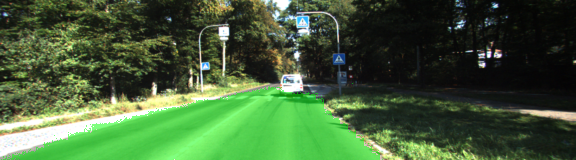
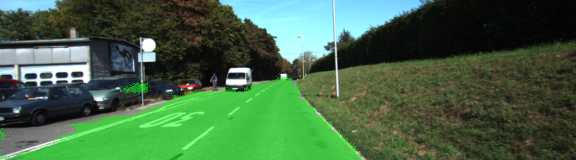
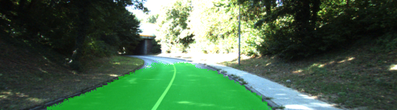
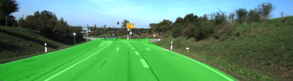
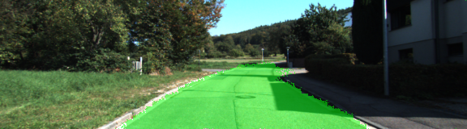

# Semantic Segmentation
By Murali Madala
murali.madala6@gmail.com


### Project Goals
The goal of semantic Segmentation project is to label the pixels of a in images using a Fully Convolutional Network (FCN) as "road" or "not road". 
This helps the autonomous vehicle in distinguishing the "road" portion of the image as drivable. 


### Model Architecture
The FCN used for this project is based on [this]( https://people.eecs.berkeley.edu/~jonlong/long_shelhamer_fcn.pdf) VGG-16 architecture.
 The FCN was built by converting a pre-trained VGG-16 network.

An Adam Optimizer was used to help the model converge faster. This model was trained/tested using the KITTI [dataset](http://www.cvlibs.net/datasets/kitti/eval_road.php).
The training images in this dataset have labeled data at the pixel level as road/not road.

I trained the model with the following hyper-parameters after some experimentation:
 Number of epochs: 20, Batch size: 16, Drop out: 0.25, & learning rate: 0.00001
 If I had better machine, I would exprimented with higher dropouts 0.35 and 0.4.

### Results
Epoch: 0/20 || Execution Time: 2115.7895469665527 seconds || Loss: 0.6899385452270508

Epoch: 1/20 || Execution Time: 2046.766263961792 seconds || Loss: 0.44442638754844666

Epoch: 2/20 || Execution Time: 2492.9687530994415 seconds || Loss: 0.1736682504415512

Epoch: 3/20 || Execution Time: 2002.774763584137 seconds || Loss: 0.22564981877803802

Epoch: 4/20 || Execution Time: 2016.5236601829529 seconds || Loss: 0.14753814041614532

Epoch: 5/20 || Execution Time: 2085.4989290237427 seconds || Loss: 0.23250333964824677

Epoch: 6/20 || Execution Time: 2082.6698701381683 seconds || Loss: 0.05865832418203354

Epoch: 7/20 || Execution Time: 2373.7246198654175 seconds || Loss: 0.1309855878353119

Epoch: 8/20 || Execution Time: 2380.628518104553 seconds || Loss: 0.1852121204137802

Epoch: 9/20 || Execution Time: 2385.6072771549225 seconds || Loss: 0.24373584985733032

Epoch: 10/20 || Execution Time: 2382.6233201026917 seconds || Loss: 0.07676880061626434

Epoch: 11/20 || Execution Time: 2117.2499260902405 seconds || Loss: 0.026296256110072136

Epoch: 12/20 || Execution Time: 2233.8481578826904 seconds || Loss: 0.15522433817386627

Epoch: 13/20 || Execution Time: 2030.5563130378723 seconds || Loss: 0.1286194622516632

Epoch: 14/20 || Execution Time: 2069.946341753006 seconds || Loss: 0.1398572027683258

Epoch: 15/20 || Execution Time: 2073.238614797592 seconds || Loss: 0.09935903549194336

Epoch: 16/20 || Execution Time: 2235.20800113678 seconds || Loss: 0.08526550233364105

Epoch: 17/20 || Execution Time: 2013.5014171600342 seconds || Loss: 0.03792387619614601

Epoch: 18/20 || Execution Time: 2202.5083408355713 seconds || Loss: 0.05481530353426933

Epoch: 19/20 || Execution Time: 2375.2575030326843 seconds || Loss: 0.08635124564170837

Note: Loss is the loss from last batch of an epoch. I could have average loss over batch size. This is the reason for noise.

Final result images in classifying road vs non-road.









### Comments
Although the model performs relatively well, there are a number of places I feel I could improve the performance using image augmentation,
iterating with hyper-parameter selection for training and varying batch size & drop-outs before final submission.
More classes for segmentation could have been created, Cars, street-signs, shoulder, grass etc.,

### The following is Udacity's default README for this project 
----
### Introduction

In this project, you'll label the pixels of a road in images using a Fully Convolutional Network (FCN).

### Setup
##### Frameworks and Packages
Make sure you have the following installed:

- [Python 3](https://www.python.org/)
- [TensorFlow](https://www.tensorflow.org/)
- [NumPy](http://www.numpy.org/)
- [SciPy](https://www.scipy.org/)

##### Dataset
Download the [Kitti Road dataset](http://www.cvlibs.net/datasets/kitti/eval_road.php) from [here](http://www.cvlibs.net/download.php?file=data_road.zip).  Extract the dataset in the `data` folder.  This will create the folder `data_road` with all the training a test images.

### Start
##### Implement
Implement the code in the `main.py` module indicated by the "TODO" comments.
The comments indicated with "OPTIONAL" tag are not required to complete.
##### Run
Run the following command to run the project:
```
python main.py
```
**Note** If running this in Jupyter Notebook system messages, such as those regarding test status, may appear in the terminal rather than the notebook.

### Submission
1. Ensure you've passed all the unit tests.
2. Ensure you pass all points on [the rubric](https://review.udacity.com/#!/rubrics/989/view).
3. Submit the following in a zip file.
 - `helper.py`
 - `main.py`
 - `project_tests.py`
 - Newest inference images from `runs` folder  (**all images from the most recent run**)
 
### Tips
- The link for the frozen `VGG16` model is hardcoded into `helper.py`.  The model can be found [here](https://s3-us-west-1.amazonaws.com/udacity-selfdrivingcar/vgg.zip)
- The model is not vanilla `VGG16`, but a fully convolutional version, which already contains the 1x1 convolutions to replace the fully connected layers. Please see this [forum post](https://discussions.udacity.com/t/here-is-some-advice-and-clarifications-about-the-semantic-segmentation-project/403100/8?u=subodh.malgonde) for more information.  A summary of additional points, follow. 
- The original FCN-8s was trained in stages. The authors later uploaded a version that was trained all at once to their GitHub repo.  The version in the GitHub repo has one important difference: The outputs of pooling layers 3 and 4 are scaled before they are fed into the 1x1 convolutions.  As a result, some students have found that the model learns much better with the scaling layers included. The model may not converge substantially faster, but may reach a higher IoU and accuracy. 
- When adding l2-regularization, setting a regularizer in the arguments of the `tf.layers` is not enough. Regularization loss terms must be manually added to your loss function. otherwise regularization is not implemented.
 
### Using GitHub and Creating Effective READMEs
If you are unfamiliar with GitHub , Udacity has a brief [GitHub tutorial](http://blog.udacity.com/2015/06/a-beginners-git-github-tutorial.html) to get you started. Udacity also provides a more detailed free [course on git and GitHub](https://www.udacity.com/course/how-to-use-git-and-github--ud775).

To learn about REAMDE files and Markdown, Udacity provides a free [course on READMEs](https://www.udacity.com/courses/ud777), as well. 

GitHub also provides a [tutorial](https://guides.github.com/features/mastering-markdown/) about creating Markdown files.
